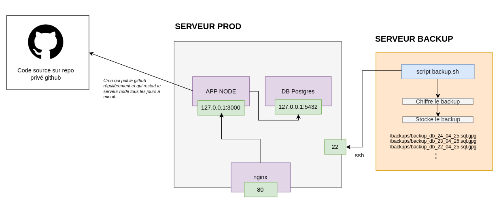

# ESGI Admin serveur web exo 1

## Infra



## Exo

Forkez le projet Github de l’application et faites le nécessaire pour vous approcher de cette infra.

Pour la création des backups via la connection ssh, créer un utilisateur `robot` ou `backup` sur la machine `prod` et restreignez le plus possible les droits de cet utilisateur.

## Vagrantfile source

Pour ceux qui travaillent avec Vagrant:

```ruby
Vagrant.configure("2") do |config|
    config.vm.box = "debian/bookworm64"

    config.vm.define "app" do |app|
      app.vm.network "private_network", type: "dhcp"
      app.vm.network "forwarded_port", guest: 80, host: 8080
      app.vm.network "forwarded_port", guest: 3000, host: 3000
      app.vm.network "forwarded_port", guest: 5432, host: 5432
      app.vm.synced_folder ".", "/vagrant"

      app.vm.provision "shell", inline: <<-SCRIPT
        # Installation de PostgreSQL, vim et curl
        apt update && apt install -y postgresql vim curl git

        # Création de la base
        sudo -u postgres createdb prod_db

        # Création de la table
        sudo -u postgres psql prod_db <<EOF
DROP TABLE IF EXISTS etudiants;
CREATE TABLE etudiants (
    id SERIAL PRIMARY KEY,
    nom VARCHAR(100),
    email VARCHAR(100)
);
INSERT INTO etudiants (nom, email) VALUES
    ('Alice Dupont', 'alice@example.com'),
    ('Bob Martin', 'bob@example.com'),
    ('Charlie Durand', 'charlie@example.com');

CREATE ROLE prod WITH LOGIN PASSWORD 'prod_password';
GRANT CONNECT ON DATABASE prod_db TO prod;
GRANT ALL PRIVILEGES ON ALL TABLES IN SCHEMA public TO prod;
GRANT ALL PRIVILEGES ON ALL SEQUENCES IN SCHEMA public TO prod;
GRANT ALL PRIVILEGES ON ALL FUNCTIONS IN SCHEMA public TO prod;

CREATE ROLE backup_user WITH LOGIN PASSWORD 'backup_password';
GRANT CONNECT ON DATABASE prod_db TO backup_user;
GRANT SELECT ON ALL TABLES IN SCHEMA public TO backup_user;
GRANT USAGE, SELECT ON ALL SEQUENCES IN SCHEMA public TO backup_user;

EOF
      SCRIPT
    end

    config.vm.define "backup" do |backup|
      backup.vm.network "private_network", type: "dhcp"
      backup.vm.synced_folder ".", "/vagrant"

      backup.vm.provision "shell", inline: <<-SCRIPT
        apt update && apt install -y vim curl git
      SCRIPT
    end
  end

```

Pour ceux qui sont sur le cloud, installez postgresql sur la machine `server`.
Réutilisez le commandes dans le provisionning du Vagrantfile pour créer la base de données et la table.
